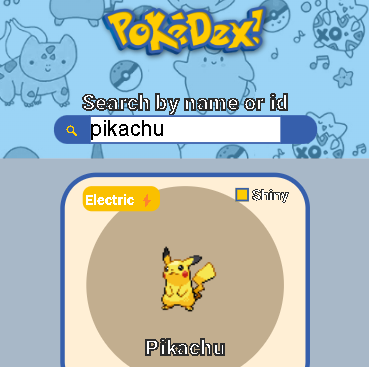
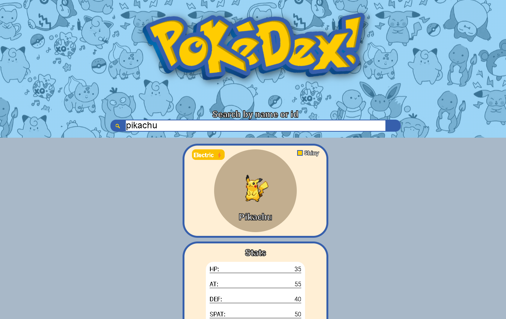

# Pokémon search app

Este é um projeto básico para treinar e consolidar o aprendizado sobre **como consumir apis públicas** e criar um app funcional com elas. Utilizei neste projeto o **React** com **Vite** onde criei alguns componentes para adequar ao propósito do app.
O css do projeto por mais que seja muito ainda não é o foco, o foco é o consumo da api do site pokeapi.co.

# Por que usei essa api?

A api do pokeapi.co é facil de usar, sendo que seu método de **get** funciona no próprio link de conexão com a api, exemplo:

- Para buscar por exemplo o pokémon ditto utilizamos o link da seguinte forma:
  > https://pokeapi.co/api/v2/pokemon/ditto
  > ou
  > https://pokeapi.co/api/v2/pokemon/132

###

A forma com a qual podemos trabalhar com ela é pelo nome do pokémon ou pela id do mesmo que queremos buscar, tendo isso em mente podemos criar diversos tipos de apps como por exemplo, um app onde você recebe um pokemon aleatório, pego com base em seu id, utilizando um método de Math.random( ) para gera-lo, e tendo que adivinhar seu nome. As possibilidades são grandes.

###

# Linguagens utilizadas

Utilizei nesse projeto as linguagens:

    

        
        CSS3
    

    

    

        
        JAVASCRIPT
    

    

    

        
        REACT
    

###

# Preview do projeto

Nas imagens abaixo você poderá ver uma preview do projeto.

    
    

 
###

# Como rodar o projeto em seu computador?

Para rodar o projeto em seu computador, primeiro crie uma pasta onde deseja receber o projeto e tenha certeza de ter o **Git** instalado no seu computador.

Depois disso você precisará seguir esses passos:

- Abrir o **cmd** e ir até a sua pasta utilizando o comando **cd/caminho da pasta**, ou ja abrir o **cmd** dentro da pasta clicando com o botão direito dentro dela e clicando na opção **Abrir no terminal**.

###

- Colar este comando no **prompt**:
  `git clone https://github.com/LeozinGs/pokedex-api-study.git `
  e apertar Enter.

###

- Esperar até terminar de clonar o repositório e instalar o **NodeJS** que trará os comandos de **npm** para nós. Ele pode ser baixado por [aqui](https://nodejs.org/en/).

###

- Depois de **clonar o repositório** e instalar o **NodeJS** abra a pasta do projeto com o **VsCode** (que pode ser baixado por [aqui](https://code.visualstudio.com/)) abra o terminal com o comando `ctrl + '` e digite `npm install` para instalar todas as dependências que o projeto usa.

###

- Assim que todas as dependências estiverem baixadas, basta dar o comando `npm run dev` no mesmo console que você usou para baixar as dependências e clicar no link em azul que aparecerá como http://localhost:(algum numero)/

###

E pronto, o projeto está clonado e rodando direto de sua máquina.
